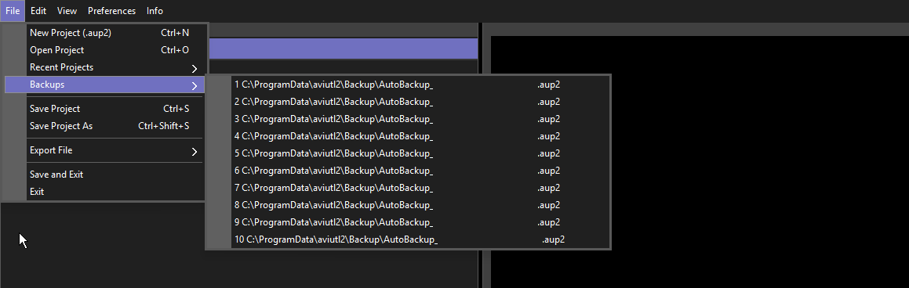
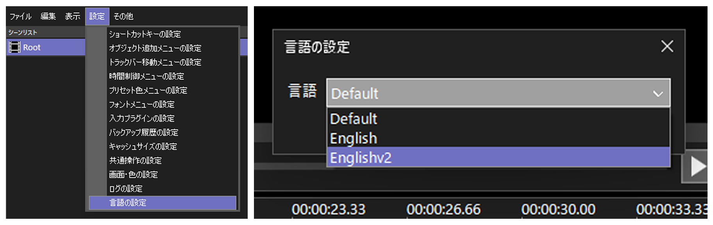
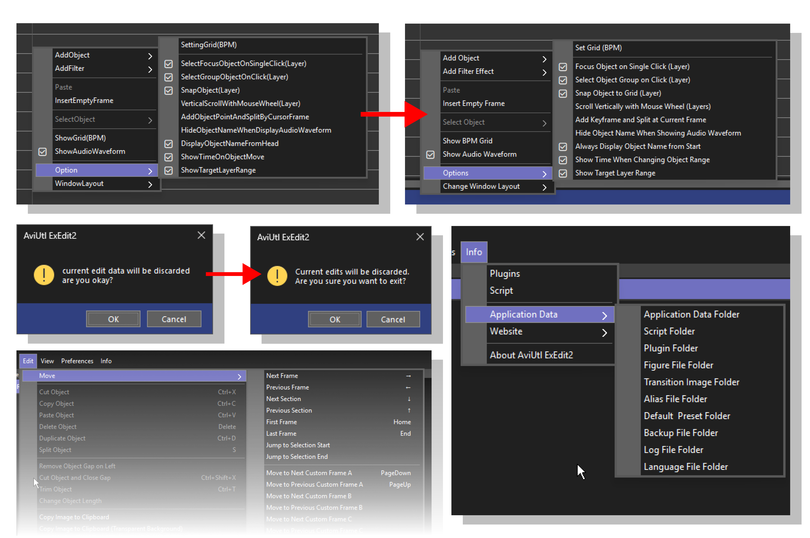

##  click [>> here <<](https://github.com/32enoki/Englishv2.aul2/releases/latest/download/Englishv2.aul2) to download Englishv2.aul2
and drop it to `C:\ProgramData\aviutl2\Language`, have fun

# Englishv2.aul2 for  AviUtl Exedit2

it's English.aul2 but improved

## ⬇️ installation?
check the top of the README, thank you
if you don't know how to set the language, see below:

## what's improved?

#### and many more...

## !!! disclaimer !!!

this translation file was created with the help of a translation tool, so some inconsistencies may occur.

If you notice any errors or mistakes, please submit a pull request to help improve it.

## 🗃️ LICENSE

this work is licensed under a [Creative Commons Attribution-NonCommercial 4.0 International License](https://creativecommons.org/licenses/by-nc/4.0/).

### credits
- original project by [ＫＥＮくん (Kenkun)](https://spring-fragrance.mints.ne.jp/aviutl/)
- translation with [DeepL Translator](https://www.deepl.com/en/products/translator)
- you :]
